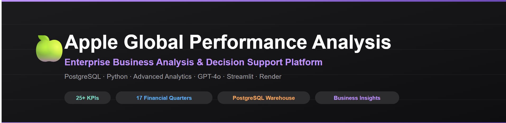
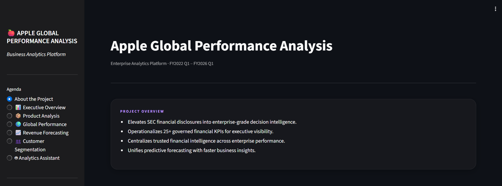
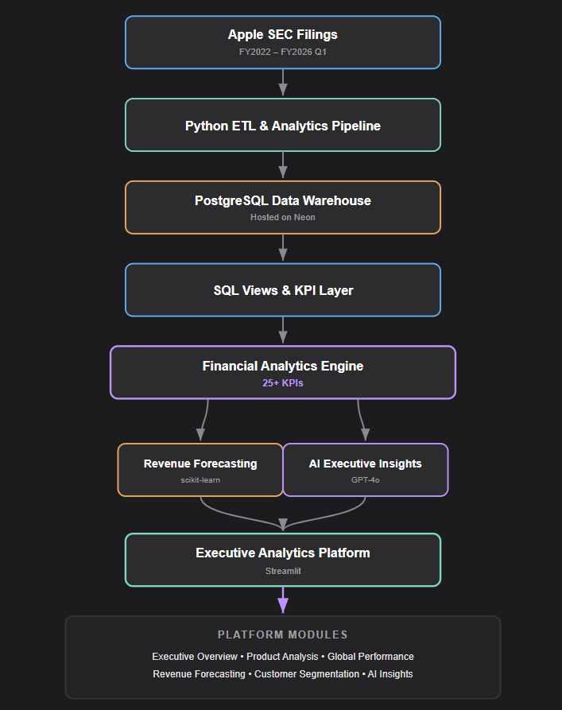
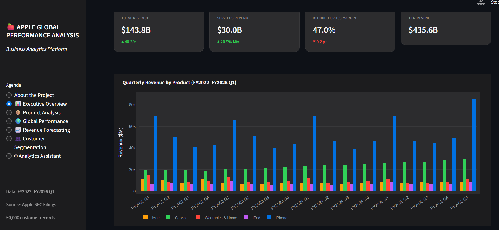
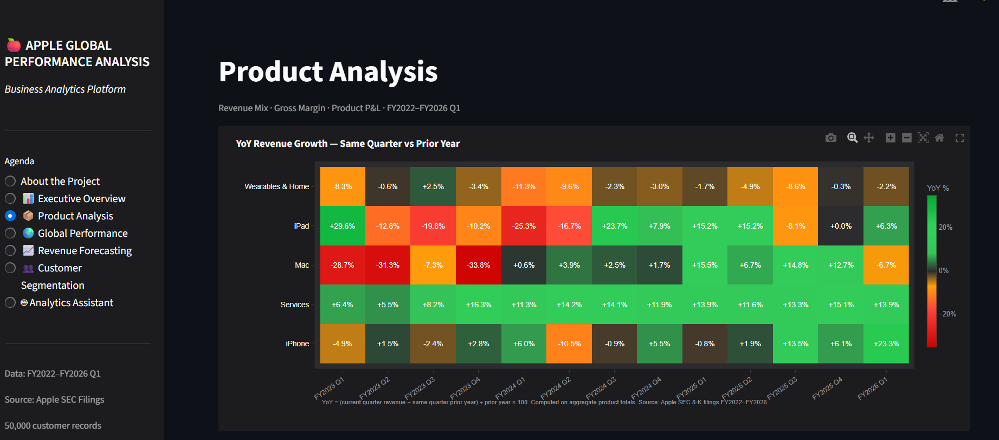
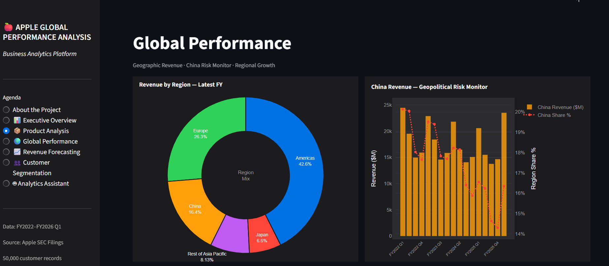
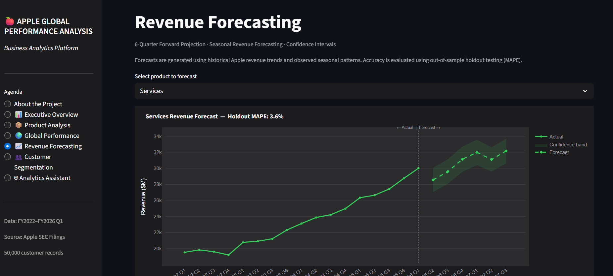
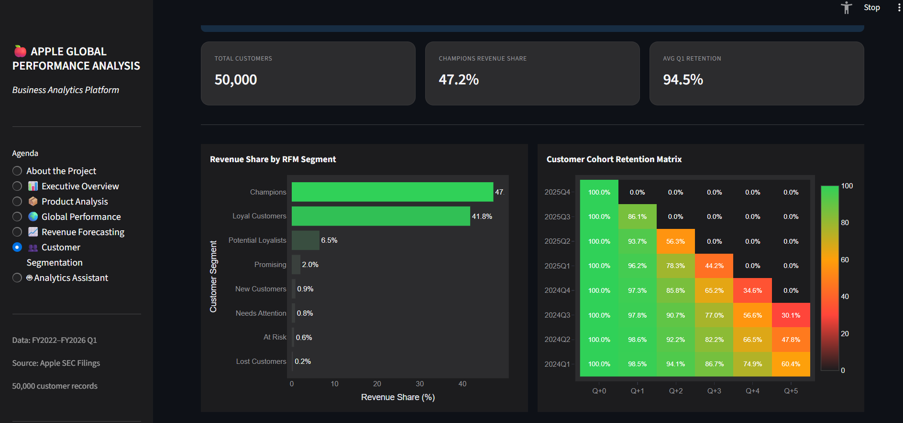
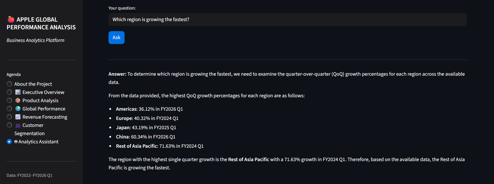

<!-- ========================================================= -->
<!-- HERO BANNER -->
<!-- ========================================================= -->


<p align="center">
  
</p>


<p align="center">
Enterprise Business Analysis & Decision Support Platform built with SQL, Python, PostgreSQL, Machine Learning and Generative AI.
</p>

<p align="center">


</p>

---


##  Live Application

https://apple-global-performance-analysis.onrender.com/

##  Dashboard Preview

<p align="center">
  
</p>


##  Overview

Apple Global Performance Analysis is an enterprise-grade financial analysis platform that transforms Apple SEC financial disclosures into impactful decision support system.

Instead of static quarterly reports, the platform delivers an integrated analytics experience combining SQL-powered financial KPIs, machine learning forecasting, AI-generated  narratives, and interactive dashboards.

The application centralizes financial core into a governed analytics platform capable of supporting executive performance monitoring, revenue analysis, forecasting, profitability analysis, and strategic decision-making.

---

# Business Problem

Traditional financial reporting suffers from several limitations:

- Static reports become outdated quickly.
- KPI calculations are often manual and inconsistent.
- Executive reporting requires significant analyst effort.
- Forecasting is performed separately from reporting.
- Financial narratives require manual interpretation.
- Decision makers lack an integrated analytics platform.

---

#  Solution

This platform replaces traditional reporting with an automated financial intelligence system.

The solution integrates:

- Automated SQL KPI computation
- Governed PostgreSQL warehouse
- Interactive executive dashboards
- Machine Learning revenue forecasting
- AI-generated executive insights
- Enterprise visualization layer
- Real-time analytical exploration

---

#  Key Features

##  Financial Intelligence

- Executive KPI dashboard
- Revenue trend analysis
- Gross margin monitoring
- Product contribution analysis
- Regional performance tracking
- Services growth analysis

---

##  Product Analysis

- Product revenue comparison
- Product mix analysis
- Revenue concentration
- Gross margin contribution
- Product growth trends

---

##  Global Performance

- Regional revenue analysis
- Geographic contribution
- Revenue heatmaps
- Regional growth comparison
- Market concentration analysis

---

##  Machine Learning Forecasting

- Seasonal Linear Regression
- Revenue forecasting
- Confidence intervals
- Product-level forecasting
- Forecast accuracy validation (MAPE)

---

##  Customer Segmentation

Synthetic customer dataset demonstrating:

- RFM Segmentation
- Customer Cohort Analysis
- Customer Lifetime Value
- Behavioral Segmentation

---

## Analtics Assistant

Powered using OpenAI GPT-4o.

Generates:

- Executive summaries
- Strategic recommendations
- Revenue commentary
- Business insights
- Forecast interpretation
- Automated financial narratives

---

#  Platform Highlights

| Capability | Description |
|------------|-------------|
| Data Source | Apple SEC Financial Filings |
| Financial Coverage | FY2022 – FY2026 Q1 |
| Database | PostgreSQL (Hosted on Neon) |
| Analytics | SQL + Python |
| Forecasting | Scikit-Learn |
| AI | OpenAI GPT-4o |
| Deployment | Render |
| Dashboard | Streamlit |
| KPIs | 25+ |
| Architecture | Enterprise Data Warehouse |

---
<!-- ========================================================= -->
<!-- SYSTEM ARCHITECTURE -->
<!-- ========================================================= -->

##  System Architecture


The platform follows a modern enterprise analytics architecture...

<p align="center">
  
</p>

The platform follows a modern enterprise analytics architecture where financial data flows through a governed PostgreSQL warehouse before being transformed into interactive dashboards, machine learning forecasts, and AI-generated executive insights.

---

## Data Flow

```text
Apple SEC Filings
        │
        ▼
Python ETL Pipeline
        │
        ▼
PostgreSQL Data Warehouse (Neon)
        │
        ▼
SQL View Layer
        │
        ▼
Financial Analytics Engine
        │
 ┌──────┴──────────┐
 ▼                 ▼
Machine Learning   AI Executive Insights
Forecasting        GPT-4o
        │
        ▼
Streamlit Executive Dashboard
        │
        ▼
Executive Decision Support
```

---

#  Technology Stack

| Layer | Technologies |
|---------|-------------|
| Programming Language | Python 3.11 |
| Database | PostgreSQL |
| Cloud Database | Neon |
| Query Layer | SQL + SQLAlchemy |
| Data Processing | Pandas, NumPy |
| Machine Learning | Scikit-Learn |
| Forecasting | Seasonal Linear Regression |
| Visualization | Plotly |
| Dashboard | Streamlit |
| AI | OpenAI GPT-4o |
| Deployment | Render |
| Version Control | Git + GitHub |

---

#  Project Structure

```text
apple-global-performance-analysis/
│
├── .streamlit/
│   └── config.toml
│
├── .vscode/
│   └── settings.json
│
├── analytics/
│   ├── __init__.py
│   ├── cohort_analysis.py
│   ├── db_connector.py
│   ├── forecasting.py
│   ├── margin_analysis.py
│   └── rfm_analysis.py
│
├── app/
│   ├── __init__.py
│   └── app.py
│
├── assets/
│   ├── banner.png
│   ├── hero-dashboard.png
│   ├── architecture.png
│   └── screenshots/
│       ├── analytics-assistant.png
│       ├── customer-segmentation.png
│       ├── executive-overview.png
│       ├── global-performance.png
│       ├── product-analysis.png
│       └── revenue-forecasting.png
│
├── data/
│   ├── processed/
│   ├── raw/
│   └── synthetic/
│
├── database/
│
├── docs/
│
├── exports/
│   ├── ai_narratives/
│   ├── charts/
│   └── reports/
│
├── genai/
│   ├── anomaly_explainer.py
│   ├── config_ai.py
│   ├── insight_engine.py
│   ├── narrative_writer.py
│   └── README_genai.md
│
├── visualizations/
│   ├── charts.py
│   ├── dashboard.py
│   └── kpi_cards.py
│
├── apple_intelligence.sql
├── config_new.py
├── requirements.txt
├── run_full_pipeline.py
└── README.md
```

---

#  Platform Modules

| Module | Description |
|---------|-------------|
| 📊 Executive Overview | Enterprise KPI dashboard summarizing Apple's financial performance |
| 📦 Product Analysis | Revenue, growth and profitability analysis across Apple product lines |
| 🌍 Global Performance | Geographic revenue trends, regional comparisons and market concentration |
| 📈 Revenue Forecasting | Machine Learning revenue forecasting with confidence intervals |
| 👥 Customer Segmentation | Synthetic RFM and Cohort Analysis demonstrating customer analytics |
| 🤖 AI Executive Insights | GPT-4o powered Q&A Assistance|

---

# Dashboard
| Executive Overview | Product Analysis |
|--------------------|------------------|
|  |  |

| Global Performance | Revenue Forecasting |
|--------------------|---------------------|
|  |  |

| Customer Segmentation | AI Executive Insights |
|------------------------|-----------------------|
|  |  |

#  Platform Statistics

| Metric | Value |
|---------|------|
| Historical Coverage | 17 Financial Quarters |
| Data Source | Apple SEC Filings |
| Automated KPIs | 25+ |
| Dashboard Pages | 6 |
| Charts & Visualizations | 30+ |
| AI Module | GPT-4o |
| Database | PostgreSQL |
| Cloud Deployment | Render |
| Cloud Database | Neon |
| Forecast Accuracy | MAPE Validated |

---

<!-- ========================================================= -->
<!-- DATABASE -->
<!-- ========================================================= -->

#  Database Architecture

The platform follows a layered analytics architecture that separates raw financial data, business logic, and presentation. This ensures every KPI shown in the dashboard originates from a governed SQL calculation rather than being recomputed in multiple places.

### Data Layers

```
Apple SEC Filings
        │
        ▼
Raw Financial Data
        │
        ▼
PostgreSQL Warehouse
        │
        ▼
SQL Views
        │
        ▼
Analytics Engine
        │
        ▼
Interactive Dashboard
```

The warehouse acts as the **single source of truth** for every financial metric displayed across the application.

---

#  KPI Framework

The platform automatically computes financial KPIs from Apple's public SEC disclosures.

## Revenue Analytics

- Total Revenue
- Product Revenue
- Regional Revenue
- Services Revenue
- Product Contribution
- Revenue Mix
- Revenue Share

---

## Growth Analytics

- Quarter-over-Quarter Growth
- Year-over-Year Growth
- Revenue Trend
- Growth Contribution
- Revenue Acceleration

---

## Profitability Analytics

- Gross Margin
- Product Margin
- Services Margin
- Blended Margin
- Margin Expansion
- Margin Comparison

---

## Geographic Analytics

- Americas Performance
- Europe Performance
- China Performance
- Japan Performance
- Rest of Asia Pacific
- Geographic Revenue Mix
- Regional Contribution

---

## Forecast Analytics

- Revenue Forecast
- Confidence Interval
- Forecast Error
- Forecast Accuracy
- Historical Trend
- Seasonality

---

## Executive Analytics

- Executive Scorecard
- Revenue Drivers
- Strategic Risks
- Business Opportunities
- Growth Summary

---

#  Analytics Assiatnt

The platform integrates **OpenAI GPT-4o** to transform financial KPIs into executive-ready business narratives.

Unlike traditional chatbots, the AI layer does **not** generate financial figures independently.

Instead it:

- Reads structured KPI outputs
- Interprets trends
- Explains anomalies
- Generates executive summaries
- Answers business questions
- Produces strategic commentary

This ensures AI responses remain grounded in computed financial data.

---

#  Revenue Forecasting

Forecasting is implemented using **Seasonal Linear Regression** built with Scikit-Learn.

### Methodology

Historical quarterly revenue is:

1. Sorted chronologically
2. Seasonality calculated
3. Revenue deseasonalized
4. Linear Regression trained
5. Trend projected
6. Seasonality reapplied
7. Confidence intervals calculated

The forecasting engine validates predictions using:

- Mean Absolute Percentage Error (MAPE)
- Historical Holdout Validation
- Confidence Bands

This provides explainable and transparent revenue forecasting.

---

#  Business Insights Generated

The platform enables executives to answer questions such as:

- Which Apple product contributes the highest revenue?
- How dependent is Apple on the Americas?
- Is Services growing faster than Hardware?
- Which region is experiencing declining growth?
- How has Gross Margin evolved?
- What is the projected revenue next quarter?
- Which product should executives monitor?
- What strategic risks are emerging?

---

#  Business Value Delivered

| Traditional Reporting | Enterprise Analytics Platform |
|----------------------|-------------------------------|
| Static Excel reports | Interactive Dashboard |
| Manual KPI calculations | Automated SQL KPIs |
| Quarterly reporting | On-demand analysis |
| Manual forecasting | Machine Learning Forecasting |
| Manual interpretation | AI Executive Insights |
| Spreadsheet analysis | Enterprise Decision Support |

---

#  Installation

## Clone Repository

```bash
git clone https://github.com/ishaan10802/Apple-Global-Performance-Analysis.git

cd Apple-Global-Performance-Analysis
```

---

## Install Dependencies

```bash
pip install -r requirements.txt
```

---

## Configure Environment Variables

Create a **.env**

```
DB_HOST=your_host

DB_PORT=5432

DB_NAME=apple_intelligence

DB_USER=your_username

DB_PASSWORD=your_password

OPENAI_API_KEY=your_key
```

---

## Run Complete Pipeline

```bash
python run_full_pipeline.py
```

---

## Start Dashboard

```bash
streamlit run app/app.py
```

---

# Deployment

The production application is deployed using a modern cloud architecture.

| Component | Platform |
|------------|----------|
| Dashboard Hosting | Render |
| Database | Neon PostgreSQL |
| Application | Streamlit |
| AI | OpenAI GPT-4o |
| Version Control | GitHub |

Live Application

https://apple-global-performance-analysis.onrender.com/

---

#  Security

Sensitive credentials are **never stored** inside the repository.

The application securely loads:

- Database Credentials
- OpenAI API Key

using environment variables.

This follows production deployment best practices.

---


<!-- ========================================================= -->
<!-- SKILLS -->
<!-- ========================================================= -->

#  Skills Demonstrated

This project showcases an end-to-end analytics workflow spanning data engineering, business intelligence, machine learning, cloud deployment, and AI integration.

### Data Analytics

- Exploratory Data Analysis (EDA)
- Financial KPI Design
- Business Performance Analysis
- Executive Reporting
- Revenue & Margin Analysis
- Time-Series Analysis

### SQL & Database

- PostgreSQL
- SQL View Design
- Data Modeling
- Aggregation & Window Functions
- Analytics Query Optimization

### Python

- Pandas
- NumPy
- SQLAlchemy
- Modular Project Design
- Data Pipelines

### Machine Learning

- Scikit-Learn
- Seasonal Linear Regression
- Forecast Validation
- MAPE Evaluation
- Confidence Interval Estimation

### Business Intelligence

- Streamlit
- Plotly
- Interactive Dashboards
- KPI Scorecards
- Executive Visualizations

### AI Integration

- OpenAI GPT-4o
- AI Narrative Generation
- Business Insight Generation

### Cloud & Deployment

- Render
- Neon PostgreSQL
- Git
- GitHub

---

#  Business Impact

The platform demonstrates how traditional financial reporting can be transformed into an interactive executive analytics solution.

### Key Outcomes

- Centralized financial intelligence into a governed PostgreSQL warehouse.
- Automated KPI generation using reusable SQL pipelines.
- Delivered interactive dashboards for executive decision-making.
- Integrated machine learning for revenue forecasting.
- Enhanced reporting with AI-generated financial narratives.
- Deployed a cloud-hosted analytics platform accessible through the web.

---

#  Project Highlights

| Feature | Status |
|---------|:------:|
| Interactive Dashboard | ✅ |
| PostgreSQL Data Warehouse | ✅ |
| SQL Analytics Layer | ✅ |
| Executive KPI Reporting | ✅ |
| Product Intelligence | ✅ |
| Regional Intelligence | ✅ |
| Machine Learning Forecasting | ✅ |
| AI Business Insights | ✅ |
| Cloud Deployment | ✅ |

---

#  Future Enhancements

Potential future improvements include:

- Snowflake Data Warehouse integration
- Power BI reporting layer
- Role-based authentication
- Executive PDF reporting
- Scheduled automated reports
- CI/CD deployment pipeline
- Docker containerization
- Cloud deployment on Azure or AWS
- Enhanced forecasting models
- Additional financial statement analytics

---

#  Data Source

The financial data used in this project is derived from publicly available Apple financial disclosures.

**Primary Source**

- Apple Inc. Quarterly and Annual SEC Filings (Form 10-Q and Form 10-K)

Coverage:

- FY2022
- FY2023
- FY2024
- FY2025
- FY2026 Q1

Customer analytics shown in the application are generated from a **synthetic dataset** and are included solely to demonstrate customer analytics techniques such as RFM segmentation and cohort analysis.

---

#  License

This repository is intended for educational and portfolio purposes.

The project demonstrates modern data analytics, financial intelligence, machine learning, and AI integration using publicly available financial information.

---

# Author

**Ishaan Aditya**

Advanced Data Analytics | SQL | Python | PostgreSQL | AI

GitHub:
https://github.com/ishaan10802

Email:
ishaan10802@gmail.com

---

#  Acknowledgements

This project was inspired by real-world enterprise financial reporting practices and built using:

- Apple SEC Financial Filings
- PostgreSQL
- Python
- Streamlit
- Plotly
- Scikit-Learn
- OpenAI GPT-4o
- Render
- Neon

---

<p align="center">

⭐ If you found this project interesting, consider giving it a star.

</p>
